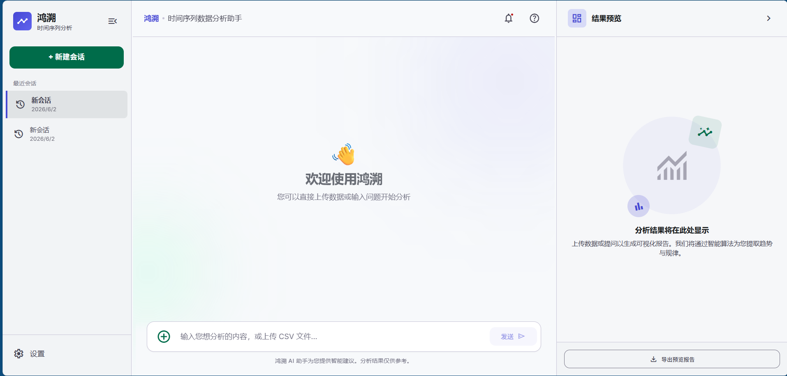
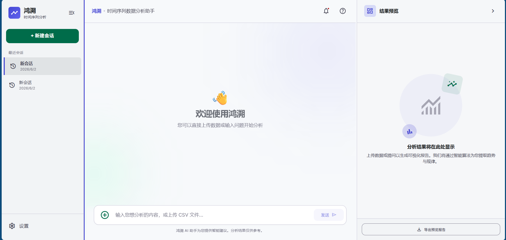
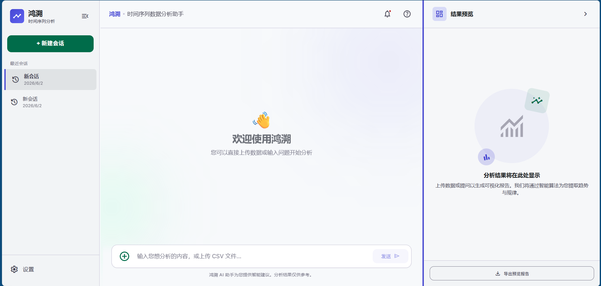
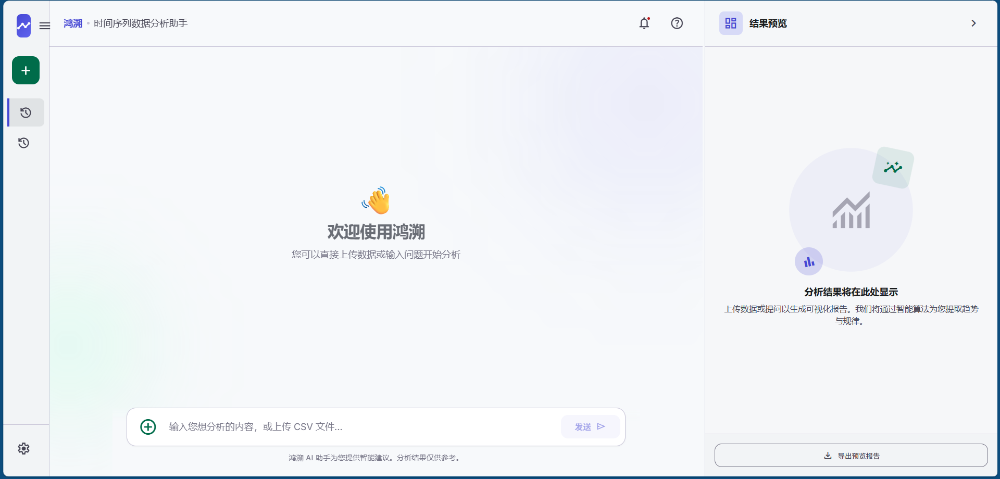
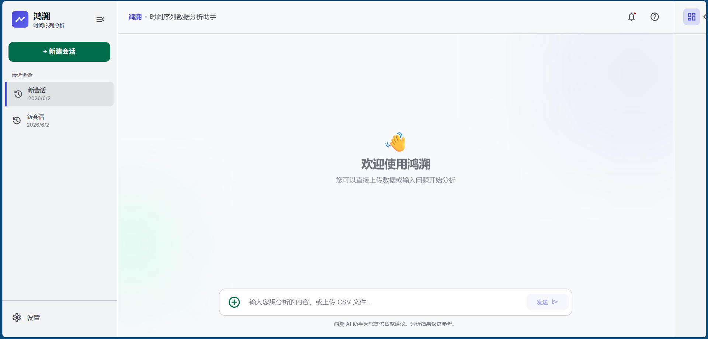
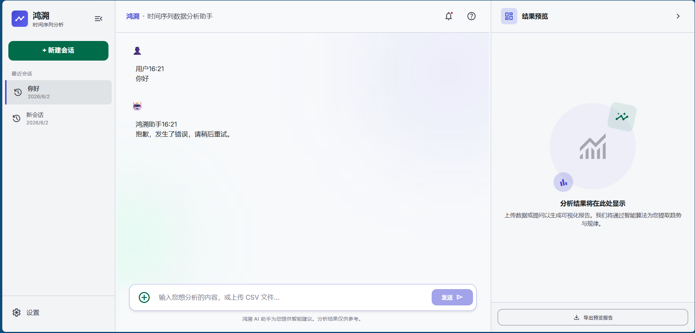
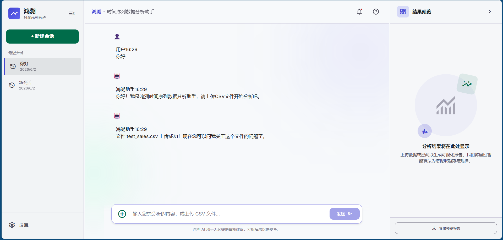
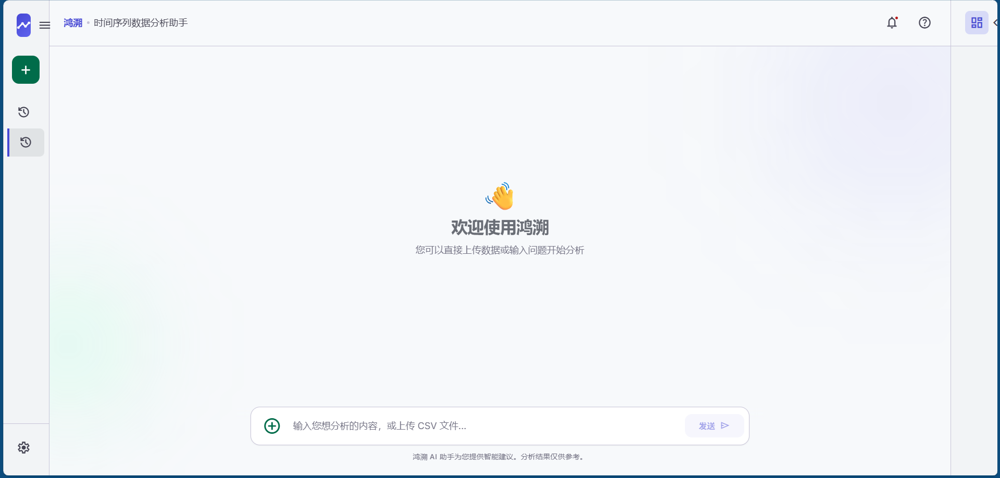

# 最终前端设计文档

## 1. 设计逻辑

### 1.1 整体架构
采用**三栏弹性布局**，从左到右依次为：
- **左侧会话栏**（Sidebar）：管理历史会话、创建新会话、系统设置
- **中间聊天栏**（Main Content）：用户交互区域，包含Header、聊天区域、输入区域
- **右侧结果栏**（Result Panel）：显示分析结果和可视化图表

### 1.2 核心设计原则
- **灵活可调整**：左右两侧栏宽度可通过拖拽自由调整
- **空间利用率**：提供收起/展开功能，最大化中间聊天区域
- **用户体验优先**：保持界面简洁，重要功能触手可及
- **响应式布局**：各区域尺寸动态适应，整体协调美观

### 1.3 模块结构
```
App
├── Sidebar（左侧会话栏）
│   ├── Logo区域
│   ├── 新建会话按钮
│   ├── 历史会话列表
│   └── 设置按钮
├── Main Content（中间聊天栏）
│   ├── Header（页面顶部导航）
│   ├── Chat Area（聊天区域）
│   │   ├── Welcome（欢迎界面）
│   │   └── Messages（消息列表）
│   └── Input Area（输入区域）
│       ├── 上传按钮
│       ├── 输入框
│       └── 发送按钮
└── Result Panel（右侧结果栏）
    ├── Header（结果预览标题）
    ├── Content（结果内容区）
    └── Footer（导出按钮）
```

---

## 2. 设计风格

### 2.1 色彩系统
| 色彩类型 | 颜色值 | 用途说明 |
|---------|--------|---------|
| **主色** | `#4648d4` (Primary) | Logo、按钮、拖拽高亮、品牌标识 |
| **次色** | `#006c4a` (Secondary) | 新建会话按钮、成功状态 |
| **背景** | `#f7f9fb` (Background) | 整体页面背景 |
| **表面容器** | `#f2f4f6` (Surface Container Low) | 侧边栏、结果栏背景 |
| **边框** | `#c7c4d7` (Outline Variant) | 分隔线、边框 |
| **主文本** | `#191c1e` (On Surface) | 标题、主要内容 |
| **次文本** | `#464554` (On Surface Variant) | 辅助信息、日期 |
| **占位符** | `#767586` (Outline) | 输入框占位文字 |
| **错误色** | `#ba1a1a` (Error) | 通知红点、错误提示 |

### 2.2 视觉风格特点
- **现代化极简设计**：采用简约线条，去除多余装饰
- **柔和渐变**：Logo背景使用蓝紫色渐变
- **毛玻璃效果**：Header使用半透明背景 + backdrop-filter模糊
- **圆角设计**：按钮、卡片使用8-12px圆角，更亲和
- **装饰元素**：聊天区域有抽象的圆形渐变装饰背景

### 2.3 字体系统
| 字体类型 | 字体族 | 用途 |
|---------|--------|------|
| 主要字体 | Inter | 所有文本内容 |
| 图标字体 | Material Symbols Outlined | 所有图标 |

---

## 3. 设计样式

### 3.1 布局规格
| 元素 | 默认宽度 | 可调整范围 | 收起宽度 |
|------|---------|-----------|---------|
| 左侧侧边栏 | 280px | 200-500px | 80px |
| 右侧结果栏 | 380px | 200-500px | 80px |
| 聊天区域 | 最大900px（居中） | - | - |
| 高度 | 100vh（全屏） | - | - |

### 3.2 组件样式详情

#### 3.2.1 Logo区域
- **Logo图标**：40x40px，圆角8px，渐变背景
- **应用名称**：20px，字重700
- **副标题**：12px，字重500
- **收起按钮**：32x32px，圆形，悬停变色

#### 3.2.2 Header
- **高度**：80px
- **背景**：半透明白色 `rgba(247, 249, 251, 0.8)`
- **内容**：应用名 + 副标题 + 通知 + 帮助按钮
- **效果**：毛玻璃模糊，固定在顶部

#### 3.2.3 聊天区域
- **欢迎Emoji**：👋，带动画（浮动效果）
- **消息气泡**：区分用户和助手消息
- **输入框**：带文件上传按钮，发送按钮有激活状态
- **底部提示**：12px，浅灰色文本

#### 3.2.4 结果面板
- **标题区域**：图标（40x40px）+ 标题
- **空状态**：抽象装饰图（192x192px）
- **导出按钮**：描边样式，悬停背景变深

---

## 4. 交互逻辑

### 4.1 核心交互流程

#### 4.1.1 页面初始化
1. 应用加载 → 自动创建默认会话
2. 显示欢迎界面 → 用户可以直接提问或上传文件

#### 4.1.2 侧边栏交互
- **收起/展开**：点击Logo右侧按钮 → 侧边栏在280px和80px间切换
- **拖拽调整宽度**：鼠标移到侧边栏右侧 → 出现拖拽手柄 → 按下拖拽调整宽度（200-500px）
- **新建会话**：点击绿色按钮 → 创建并切换到新会话
- **切换会话**：点击历史会话列表 → 切换到对应会话

#### 4.1.3 聊天交互
- **发送消息**：输入文字 → 按回车或点击发送 → 消息显示 → 显示打字动画 → 返回回复
- **上传文件**：点击上传按钮 → 选择CSV文件 → 上传成功提示
- **滚动聊天**：消息超出区域 → 自动滚动或手动滚动

#### 4.1.4 结果面板交互
- **收起/展开**：点击标题右侧按钮 → 结果栏在380px和80px间切换
- **拖拽调整宽度**：鼠标移到结果栏左侧 → 出现拖拽手柄 → 按下拖拽调整宽度（200-500px）
- **导出报告**：点击底部按钮 → 导出当前结果

### 4.2 动画效果
| 动画类型 | 时长 | 效果 |
|---------|------|------|
| 侧边栏收起/展开 | 300ms | 平滑过渡 |
| 按钮悬停 | 200ms | 颜色渐变 |
| 拖拽分隔线 | 200ms | 背景变色 |
| 欢迎浮动 | 6s | 上下循环浮动 |
| 打字指示器 | 1.4s | 三点循环跳动 |

---

## 5. 截图展示

### 截图1：首页完整布局



**说明**：
- 显示完整的三栏布局，所有区域都处于展开状态
- 左侧：侧边栏280px，显示Logo、新建按钮、历史会话、设置按钮
- 中间：欢迎界面，输入框显示占位文字
- 右侧：结果面板380px，显示空状态

---

### 截图2：左侧拖拽



**说明**：
- 鼠标悬停在左侧拖拽手柄上
- 显示蓝色的拖拽竖条（宽度6px）
- 鼠标指针显示为左右拖拽样式
- 可以通过拖拽调整侧边栏宽度（200-500px）

---

### 截图3：右侧拖拽



**说明**：
- 鼠标悬停在右侧拖拽手柄上
- 显示蓝色的拖拽竖条（宽度6px）
- 可以通过拖拽调整结果栏宽度（200-500px）

---

### 截图4：左侧收起状态



**说明**：
- 左侧侧边栏处于收起状态，宽度为80px
- 只显示图标，隐藏文字
- 收起按钮显示"menu"图标
- 中间聊天区域宽度相应变宽

---

### 截图5：右侧收起状态



**说明**：
- 右侧结果面板处于收起状态，宽度为80px
- 只显示收起/展开按钮
- 所有内容区域都隐藏
- 左侧保持展开，对比效果

---

### 截图6：聊天界面（含消息）



**说明**：
- 显示用户消息和助手回复
- 消息显示角色标识和时间
- 聊天区域有装饰背景（右上角和左下角的模糊圆）
- 输入框有内容，发送按钮激活

---

### 截图7：文件上传成功



**说明**：
- 显示文件上传成功的系统提示消息
- 消息包含文件名和成功提示
- 展示完整的上传流程结果

---

### 截图8：左右都收起



**说明**：
- 左侧侧边栏和右侧结果栏都处于收起状态（各80px）
- 中间聊天区域最大化
- 展示最小化两侧栏后的最大聊天空间效果

---

## 6. 技术实现说明

### 6.1 核心技术
- **框架**：React 18.3.1
- **语言**：TypeScript
- **构建工具**：Vite 6.0.11
- **图标库**：Material Symbols Outlined

### 6.2 关键实现技术
- **Flex布局**：整体采用`display: flex`实现自适应
- **动态宽度**：使用React状态管理各栏宽度
- **鼠标拖拽**：监听`mousedown`、`mousemove`、`mouseup`事件实现拖拽
- **状态管理**：使用React hooks（useState、useEffect）
